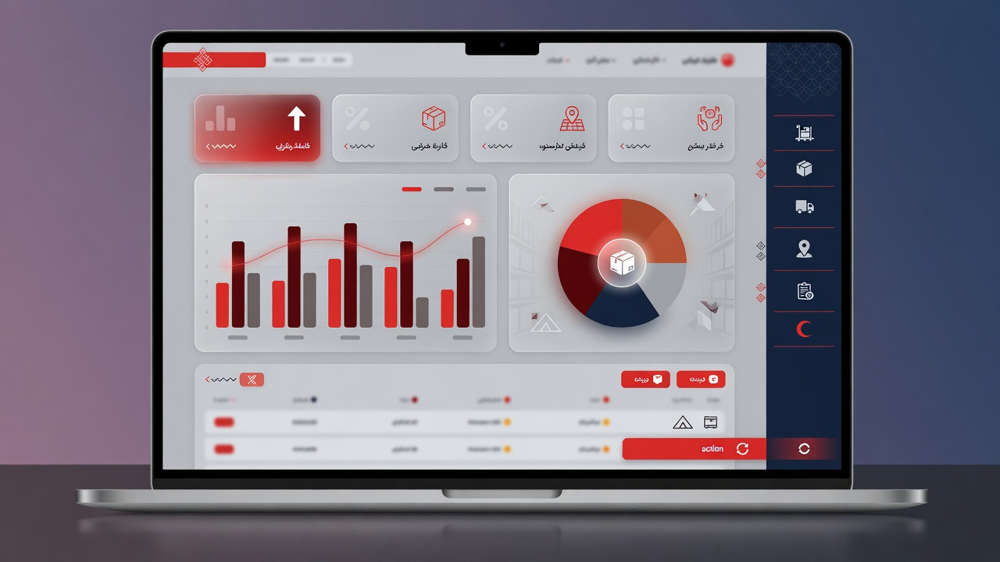

# سامانه انبارداری هلال احمر — کهگیلویه

<p align="center">
  
</p>

<p align="center">
  <strong>نرم‌افزار دسکتاپ آفلاین مدیریت انبار امدادی</strong><br/>
  جمعیت هلال احمر شهرستان کهگیلویه
</p>

<p align="center">
  <a href="https://askarniroomand.github.io/helal-anbar-showcase/"></a>
  <a href="https://askarniroomand.github.io/helal-anbar-showcase/demo/"></a>
  
  
</p>

---

## ⚠️ این مخزن فقط Showcase است

| چه چیزی اینجا هست | چه چیزی اینجا **نیست** |
|---|---|
| صفحه معرفی حرفه‌ای | ❌ کد منبع Python / PySide6 |
| دموی تعاملی UI (HTML) | ❌ منطق کسب‌وکار و دیتابیس واقعی |
| موکاپ و مستندات سطح‌بالا | ❌ Credential، بکاپ، یا فایل اجرایی کامل |
| مجوز اختصاصی | ❌ لایسنس متن‌باز |

> **سورس کامل نرم‌افزار در مخزن خصوصی نگهداری می‌شود** و به‌صورت عمومی در دسترس نیست.  
> هدف این ریپو: معرفی محصول + نمایش دمو — نه انتشار کد.

---

## ✨ قابلیت‌ها (محصول واقعی)

- **مدیریت اقلام** — ثبت، ویرایش، موجودی، تاریخچه
- **ورود و خروج (حواله)** — با پیوست و چاپ رسمی
- **امانت** — پیگیری سررسید و بازگشت
- **دپو** — قفل، انتقال جزئی / کامل
- **انبارهای چندگانه** و اقلام ویژه (برگشتی، اسقاطی، مستعمل، اهدایی)
- **داشبورد** با کارت آمار و نمودار
- **گزارش Excel و PDF** با پشتیبانی کامل فارسی (RTL)
- **تقویم شمسی** در کل سامانه
- **بکاپ خودکار** ماهانه
- **تم Light / Dark** با پالت هلال احمر
- **نقش‌ها:** مدیر IT و انباردار

---

## 🖥️ دموی رابط کاربری

دموی وب فقط ظاهر و جریان UI را شبیه‌سازی می‌کند (بدون Backend):

**[▶ باز کردن دموی تعاملی](https://askarniroomand.github.io/helal-anbar-showcase/demo/)**

<p align="center">
  
</p>

---

## 🏗️ معماری (سطح‌بالا — بدون جزئیات پیاده‌سازی)

```text
┌─────────────────────────────────────────┐
│           Desktop UI (RTL)              │
│   Dashboard · Items · Entry · Dispatch  │
│   Loans · Depot · Reports · Settings    │
└──────────────────┬──────────────────────┘
                   │
┌──────────────────▼──────────────────────┐
│         Application Services            │
│     Auth · Report · Print · Backup      │
└──────────────────┬──────────────────────┘
                   │
┌──────────────────▼──────────────────────┐
│          Offline Data Layer             │
│         SQLite · File Attachments       │
└─────────────────────────────────────────┘
```

جزئیات کد، schema و الگوریتم‌ها عمداً منتشر نمی‌شوند.

---

## 📦 استقرار (محصول واقعی)

| مورد | توضیح |
|------|--------|
| پلتفرم هدف | Windows 10/11 (بسته پرتابل) |
| شبکه | **آفلاین** — بدون نیاز به اینترنت |
| نصب | Extract و اجرا — بدون نصب Python برای کاربر نهایی |
| داده | دیتابیس محلی کنار برنامه + پوشه بکاپ |

فایل اجرایی از طریق مالک نرم‌افزار ارائه می‌شود؛ در این ریپو قرار ندارد.

---

## 🔐 امنیت و مالکیت

- مجوز: **[Proprietary](LICENSE)** — همه حقوق محفوظ است
- سیاست امنیتی: **[SECURITY.md](SECURITY.md)**
- بازتولید، کپی UI به‌عنوان محصول مستقل، یا مهندسی معکوس بدون مجوز کتبی **ممنوع** است

---

## 📞 تماس / درخواست نسخه

| | |
|--|--|
| **توسعه‌دهنده** | امدادگر عسکر نیرومند |
| **موبایل** | `09331351329` |
| **سازمان** | جمعیت هلال احمر شهرستان کهگیلویه |

برای درخواست **دمو کامل دسکتاپ**، استقرار در اداره، یا خرید/مجوز استفاده پیام دهید.

---

## 📁 ساختار این ریپو (عمومی)

```text
helal-anbar-showcase/
├── index.html          # لندینگ معرفی
├── demo/               # دموی تعاملی UI (HTML/CSS/JS)
├── assets/             # بنر و موکاپ
├── docs/               # مستندات سطح‌بالا
├── LICENSE             # مجوز اختصاصی
├── SECURITY.md
└── README.md
```

---

<p align="center">
  ساخته‌شده با دقت برای عملیات امدادی · © ۱۴۰۵ · تمامی حقوق محفوظ است
</p>
