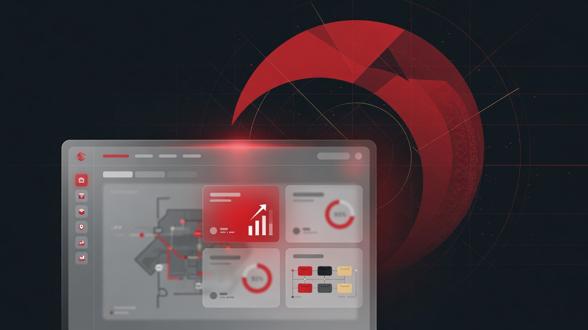

<div align="center">



# Helal Anbar · هلال‌انبار

### Enterprise warehouse UI showcase · Red Crescent Kohgiluyeh

Offline-first desktop warehouse system for relief inventory —  
receipts · issue vouchers · loans · depots · Jalali calendar · PDF/Excel reports

**Production source is private.** This repository is a public product page + static UI demo.

<br/>

[](https://askarniroomand.github.io/helal-anbar-showcase/)
[](https://askarniroomand.github.io/helal-anbar-showcase/demo/)
[](https://github.com/askarniroomand)
[](LICENSE)
[](https://github.com/askarniroomand)

</div>

---

## Professional description

**Helal Anbar** is an enterprise warehouse management product designed for relief logistics contexts where connectivity is unreliable and operators need fast Persian RTL workflows. The production application is a **Python + PySide6** offline desktop system with SQLite storage, role-based access, printable vouchers, and automated backups.

This GitHub repository intentionally ships **only**:
- Marketing landing page
- Static interactive UI demo
- High-level documentation

It does **not** include production databases, credentials, or private source code.

---

## Features (production product)

| Domain | Capabilities |
|:-------|:-------------|
| Stock | Multi-warehouse items, history, low-stock alerts |
| Inbound | Receipts with attachments |
| Outbound | Issue vouchers + official print |
| Loans | Lend / due / return flows |
| Depots | Lock · partial · full transfer states |
| Intelligence | Dashboard charts, Excel/PDF Persian reports |
| Operations | Jalali calendar, monthly backup, light/dark enterprise theme |
| Access | IT admin vs storekeeper roles |

---

## Tech stack

| Layer | Technology |
|:------|:-----------|
| Desktop UI | Python 3.11+ · PySide6 (Qt) |
| Data | SQLite (offline-first) |
| Reporting | PDF / Excel (RTL-aware) |
| Packaging | Portable Windows builds · macOS dev builds |
| Showcase | HTML/CSS static · GitHub Pages |

---

## Architecture

```text
┌─────────────────────────────────────────────┐
│  PySide6 Views (RTL enterprise UI)          │
│        ↓                                    │
│  Services / domain logic                    │
│        ↓                                    │
│  SQLite  ·  attachments  ·  backups         │
│        ↓                                    │
│  PDF/Excel report generators                │
└─────────────────────────────────────────────┘

Public GitHub  →  static demo only (this repo)
Private GitHub →  full application source
```

Case study (engineering narrative): see profile overhaul package `06-private-repos/helal-anbar-CASE-STUDY.md` or publish under `docs/case-study.md`.

---

## Screenshots

| Screen | Notes |
|:-------|:------|
| Dashboard | KPIs + charts |
| Receipts | Inbound flow |
| Voucher print | Official document layout |
| Settings | Roles / theme |

> Add captures under `assets/screenshots/` with PII removed.

---

## Installation (showcase only)

```bash
git clone https://github.com/askarniroomand/helal-anbar-showcase.git
cd helal-anbar-showcase
python3 -m http.server 8080
```

Open http://localhost:8080 — or use the live GitHub Pages links above.

**There is no production installer in this repository.**

---

## Requirements

- Modern browser for the demo
- (Production app, private) Windows 10/11 recommended; Python 3.11+ for development builds

---

## Usage

1. Open the **landing page** for product narrative  
2. Open **`/demo/`** for interactive UI  
3. Contact the author for private demos or commercial work  

---

## Configuration

None for the static showcase.

---

## Project structure

```text
helal-anbar-showcase/
├── index.html
├── demo/
├── assets/
├── docs/
├── LICENSE
├── SECURITY.md
└── README.md
```

---

## Roadmap

Showcase maintenance only (a11y, screenshots, copy).  
Product roadmap remains private with the client deployment.

---

## Known issues

- Demo forms do not persist to a real database
- Numbers/charts may be illustrative
- Desktop interaction patterns are approximated in HTML

---

## FAQ

<details>
<summary><b>Can I download the desktop app source?</b></summary>

No. Source is proprietary/private. Public materials are limited to UI showcase.
</details>

<details>
<summary><b>Is this affiliated with the Red Crescent as an official org repo?</b></summary>

This is an engineering portfolio showcase for a system built for operational use. Branding in the demo reflects the product context; do not treat this repo as an official organizational publication channel.
</details>

---

## Contributing

PRs that improve demo accessibility, typos, or screenshots are welcome.  
Do not submit leaked production code.

---

## License

Proprietary showcase license — see [LICENSE](LICENSE).

---

## Contact

- Author: [Askar Niroomand](https://github.com/askarniroomand)
- Telegram: [t.me/MRROBOT_DT](https://t.me/MRROBOT_DT)
- Live: https://askarniroomand.github.io/helal-anbar-showcase/
